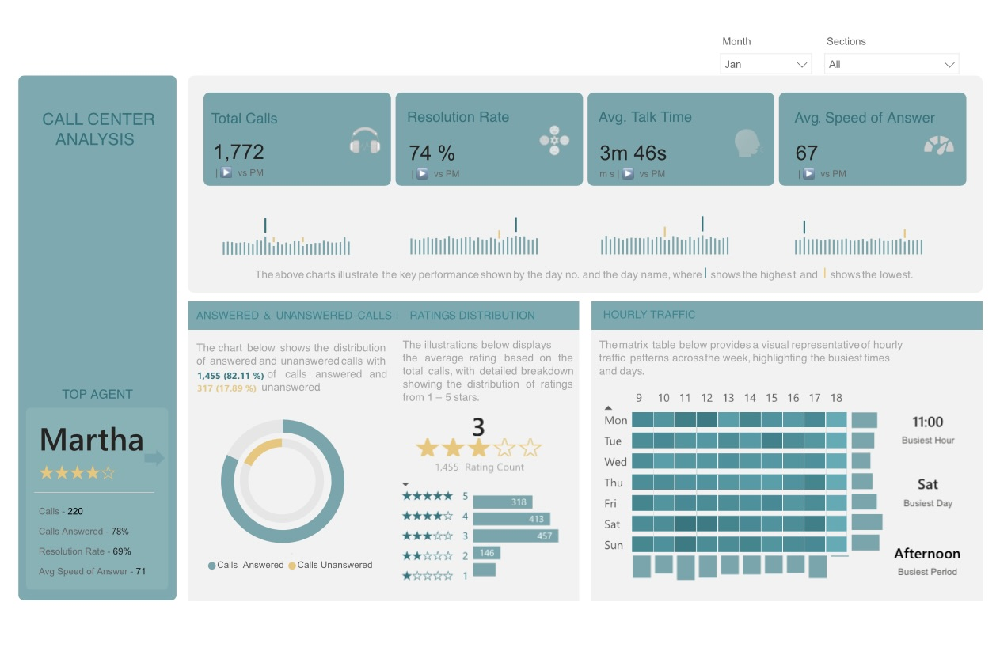
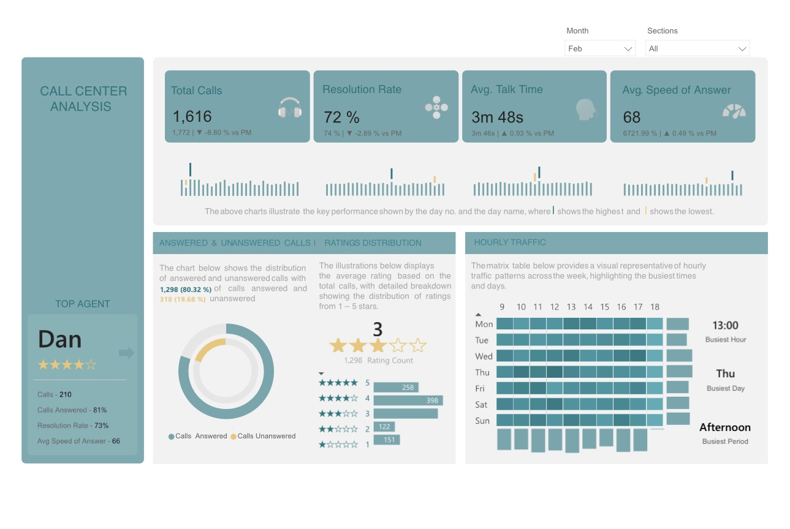
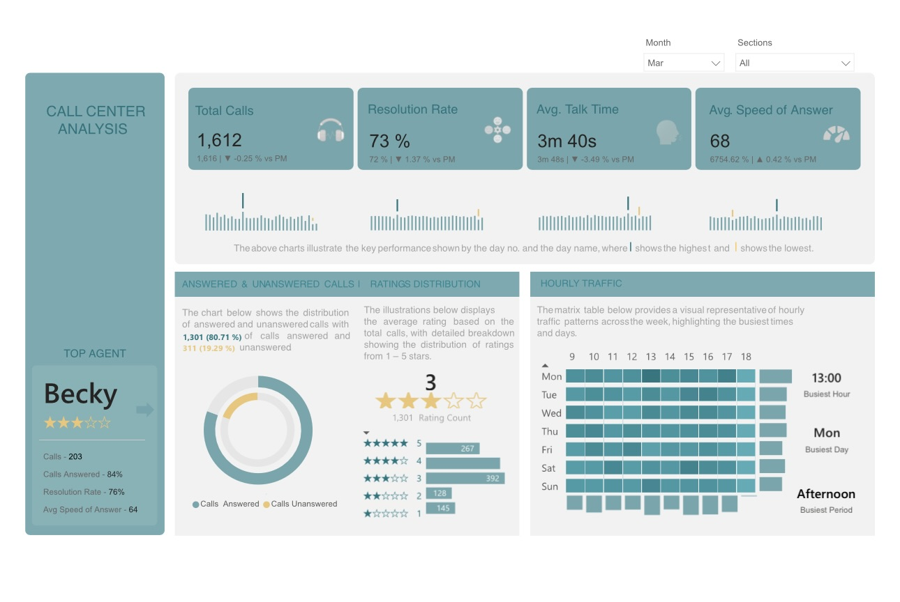

<div align="center">


<br/>


<br/>

*A Power BI analytics project examining call center performance across 5,000 inbound calls over three months, uncovering patterns in response speed, resolution consistency and customer satisfaction.*

<br/>

[](https://app.powerbi.com/view?r=eyJrIjoiOTUxYjU1NGItNGIwMi00ZDZiLTkzM2UtY2JhZDhjMmI0ODY4IiwidCI6IjE5NDVhZTU1LTc4YTAtNDUyMC05MjY0LTAwZDJkNjBhYTQyOCJ9)

<br/>

</div>

---

## Table of Contents

- [Project Background](#project-background)
- [Data Structure and Initial Checks](#data-structure-and-initial-checks)
- [Repository Structure](#repository-structure)
- [Executive Summary](#executive-summary)
- [Insights Deep-Dive](#insights-deep-dive)
  - [January](#january)
  - [February](#february)
  - [March](#march)
  - [Takeaways](#takeaways)
- [Recommendations](#recommendations)
- [Expected Outcomes](#expected-outcomes)
- [Assumptions and Caveats](#assumptions-and-caveats)
- [Links](#links)

---

## Project Background

Call Connect handles thousands of inbound calls every week across multiple departments. As call volumes grew and customer needs became more varied, leadership found itself without a clear picture of what was actually happening on the floor. Were agents answering calls fast enough? Were issues getting resolved or just closed? Were customers walking away satisfied?

I partnered with the head of customer experience to dig into the call response data, surface the performance gaps that were costing the center and translate those findings into practical recommendations. The focus was on three things that matter most in a call center environment: how quickly calls are answered, how consistently issues are resolved and how customers feel at the end of every interaction.

---

## Data Structure and Initial Checks

The dataset contains **5,000 records** capturing inbound call activity across January, February and March 2021.

### Data Model


| Field | Description |
|---|---|
| Call ID | Unique identifier for each call |
| Agent | Name of the agent who handled the call |
| Date | Date the call was received |
| Time | Time the call came in |
| Topic | Department or subject area of the call |
| Answered | Whether the call was picked up (Y/N) |
| Resolved | Whether the customer's issue was resolved (Y/N) |
| Speed of Answer | Time in seconds before the call was answered |
| Avg Talk Duration | Length of the conversation |
| Satisfaction Rating | Customer rating from 1 to 5 stars |

Before any analysis began, the dataset was run through a series of quality checks in **Power Query Editor**. This included identifying and handling missing values, validating date and time formats, standardising agent names and ensuring consistency across all categorical fields. The cleaned dataset was then loaded into Power BI where the final report was built.

---

## Repository Structure

```
call-center-report/
│
├── README.md
├── Call_Center_Report.pbix       ← Power BI report file
└── assets/
    ├── data_model.png            ← Data model and relationship view
    ├── january_dashboard.png     ← January dashboard screenshot
    ├── february_dashboard.png    ← February dashboard screenshot
    └── march_dashboard.png       ← March dashboard screenshot
```

---

## Executive Summary

> *The numbers tell a consistent story across all three months. It is not the volume of calls that is the problem. It is what happens to them once they arrive.*

The call center processed **5,000 calls** between January and March 2021. Resolution rates held at **73%** throughout the quarter, unanswered calls remained fixed at **19%** and customer satisfaction never climbed above **3 out of 5 stars**. Average talk time sat at **3 minutes 44 seconds** and average speed of answer at **67 seconds** — neither alarming in isolation, but both contributing to a pattern of missed opportunities when demand spiked.

What made this quarter particularly revealing was that performance barely moved month to month. Call volumes fluctuated, individual agents performed differently and peak hours shifted — yet the headline metrics stayed virtually the same. That consistency points to something structural rather than situational.

<br/>

<div align="center">

| Metric | Value |
|:---:|:---:|
| Total Calls | 5,000 |
| Resolution Rate | 73% |
| Unanswered Calls | 19% |
| Avg Talk Time | 3m 44s |
| Avg Speed of Answer | 67 seconds |
| Avg Customer Rating | 3 / 5 stars |

</div>

<br/>

---

## Insights Deep-Dive

### January



January opened the quarter with **1,772 calls** and a resolution rate of **74%** — the strongest of the three months but still short of where a high-performing center should be. The more pressing issue was abandonment: **317 calls (17.89%)** went unanswered, meaning nearly 1 in 5 customers never reached an agent at all.

The busiest hour was **11 AM** and **Saturdays** consistently proved the most difficult to manage, with volumes spiking in ways the current staffing model was not built to absorb. Customer ratings averaged **3 out of 5 stars** — 656 customers rated their experience 4 or 5 stars while 273 gave just 1 or 2, a split that signals inconsistency rather than outright failure.

Top agent Martha answered 78% of her 220 calls and led the team in volume handled. But her resolution rate of **69%** — well below the center average — highlighted that answering calls and resolving them are two very different things.

| Metric | January |
|---|---|
| Total Calls | 1,772 |
| Resolution Rate | 74% |
| Unanswered Calls | 317 (17.89%) |
| Avg Customer Rating | 3 / 5 |
| Busiest Hour | 11 AM |
| Busiest Day | Saturday |
| Top Agent | Martha — 78% answer rate, 69% resolution |

---

### February



February brought a 9% drop in call volume to **1,616 calls**. On paper, fewer calls should mean more manageable conditions and better outcomes. Instead the opposite happened. Resolution fell to **72%**, unanswered calls held at **318** and peak hour pressure intensified around **Thursday afternoons at 1 PM**, pushing abandonment even higher during those windows.

The customer rating picture was unchanged — **3 out of 5 stars** overall, with the same split between customers who received fast, helpful service and those who waited too long or gave up before reaching anyone. The drop in volume did not translate into any measurable improvement in how customers experienced the service.

| Metric | February |
|---|---|
| Total Calls | 1,616 |
| Resolution Rate | 72% |
| Unanswered Calls | 318 |
| Avg Customer Rating | 3 / 5 |
| Peak Pressure Point | Thursday afternoons, 1 PM |

---

### March



March closed the quarter with **1,612 calls** — the lightest month — and a resolution rate that ticked back up to **73%**, but only marginally. Unanswered calls remained at **311 (19%)**, this time concentrated on **Monday afternoons around 1 PM**, which became the single busiest hour of the month. The pattern had simply shifted, not improved.

Customer ratings mirrored the previous two months exactly — **3 out of 5 stars**, with 659 customers rating 4 to 5 stars and 273 giving 1 to 2 stars. Top agent Becky delivered the strongest individual performance of the quarter, answering 84% of her 203 calls with a **76% resolution rate**. But even her numbers reflected the same ceiling that every agent hit, regardless of their individual effort.

| Metric | March |
|---|---|
| Total Calls | 1,612 |
| Resolution Rate | 73% |
| Unanswered Calls | 311 (19%) |
| Avg Customer Rating | 3 / 5 |
| Busiest Hour | 1 PM Monday |
| Top Agent | Becky — 84% answer rate, 76% resolution |

---

### Takeaways

Three months of data pointing in the same direction is not a coincidence — it is a signal. Call volumes moved up and down, peak hours shifted across days and times, top agents rotated between months, yet the resolution rate stayed between 72% and 74%, unanswered calls never fell below 19% and customer satisfaction never moved from 3 out of 5 stars.

Martha and Becky both demonstrated that individual effort can go a long way. But neither of them — nor any other agent — could overcome the structural limitations of a system that consistently runs out of capacity exactly when demand is highest. The ceiling on performance is not the people. It is the processes and the staffing model built around them.

---

## Recommendations

**Match Staffing to Predictable Peak Windows**

Every month in this dataset showed a distinct and consistent peak — 11 AM on Saturdays in January, Thursday afternoons in February, Monday at 1 PM in March. These are not random spikes. They are patterns the scheduling model is not currently built around. Realigning shift coverage to concentrate more agents during those specific windows would reduce queue buildup and bring abandonment down without requiring additional headcount.

**Bring Answer Times Below 45 Seconds**

The current average of 67 to 68 seconds sits in an uncomfortable middle ground — not fast enough to feel responsive, not slow enough to be an obvious crisis. Research consistently shows that wait time is the single biggest driver of negative customer perception in call center environments. Dropping closer to 45 seconds through smarter call routing, reduced transfer steps and a callback option for customers who cannot wait would directly reduce abandonment and shift how the service feels to the people using it.

**Break Through the Resolution Ceiling**

A resolution rate stuck between 72% and 74% for three consecutive months — across different agents, different volumes and different topics — signals a knowledge or tooling problem, not a motivation one. Even the top performers hit the same ceiling. Auditing the most frequently unresolved call types and building targeted refresher training around those specific gaps would give agents a clearer path through difficult cases. Pairing that with accessible quick-reference materials at the agent's fingertips during calls would reduce the number of cases that get closed without being truly resolved.

**Build Consistency into the Customer Experience**

The 3 out of 5 star average is not just a low number — it is a stable one. The same split between highly satisfied and highly frustrated customers appeared every single month, which means the issue is not a bad patch. It is inconsistency baked into how calls are being handled across the team. Structured quality monitoring, regular coaching sessions anchored to call recordings and clearer service standards would start to close that gap and give customers a more predictable experience regardless of which agent picks up.

---

## Expected Outcomes

| Target | Current | Goal |
|---|---|---|
| Unanswered Call Rate | 19% | Below 12% |
| Resolution Rate | 73% | 80%+ |
| Avg Customer Rating | 3 / 5 stars | 4 / 5 stars |
| Operational Efficiency | Uneven workload distribution | Balanced through smarter scheduling |

Smarter peak-hour staffing and faster answer times should bring unanswered calls from 19% to below 12%. Targeted training and better in-call resources can push resolution rates toward 80%, reducing the volume of repeat contacts from the same customers. Consistent handling and shorter waits, applied together, should lift average satisfaction from 3 out of 5 closer to 4 out of 5. And across all of this, a scheduling model built around actual traffic patterns — rather than assumed ones — will ease agent workload, reduce burnout and improve productivity without increasing headcount.

---

## Assumptions and Caveats

- The interactive dashboard can be filtered by month and topic — no section of this report is fixed to a single view
- Customer satisfaction ratings are self-reported and may skew toward extreme experiences, with strongly positive and strongly negative customers more likely to rate than neutral ones
- Resolution rate reflects whether a call was marked resolved in the system, which may not fully capture customer sentiment — some cases logged as resolved may still have left customers without a complete answer

---

## Links

| Resource | Link |
|---|---|
| Interactive Power BI Dashboard | [View Dashboard](https://app.powerbi.com/view?r=eyJrIjoiOTUxYjU1NGItNGIwMi00ZDZiLTkzM2UtY2JhZDhjMmI0ODY4IiwidCI6IjE5NDVhZTU1LTc4YTAtNDUyMC05MjY0LTAwZDJkNjBhYTQyOCJ9) |

---

<div align="center">


</div>
